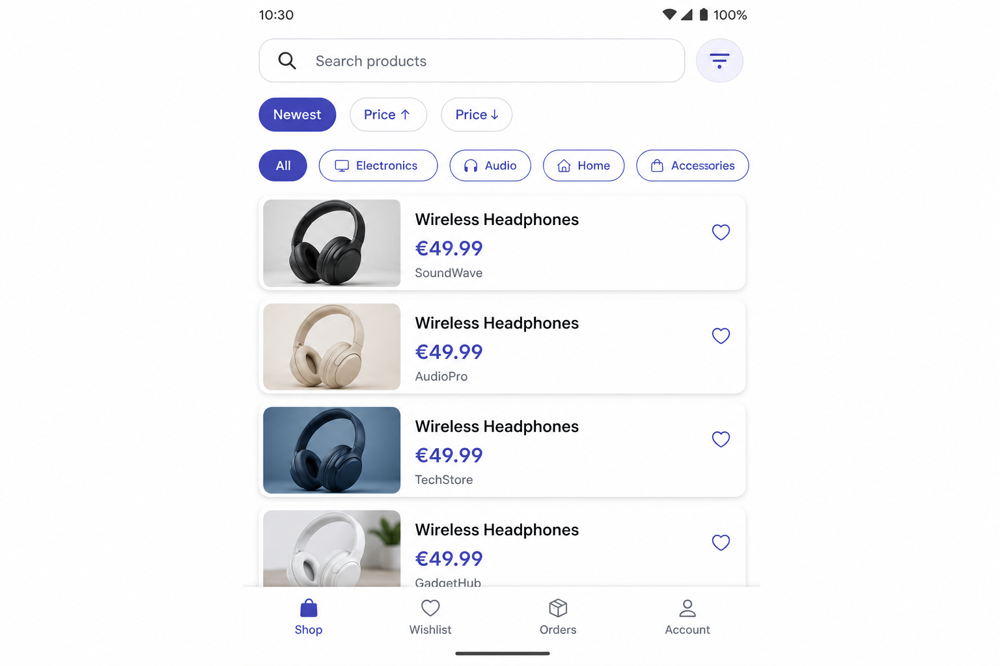
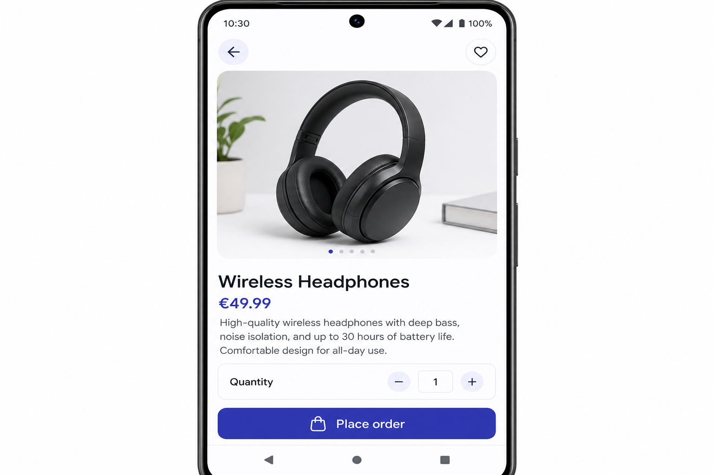
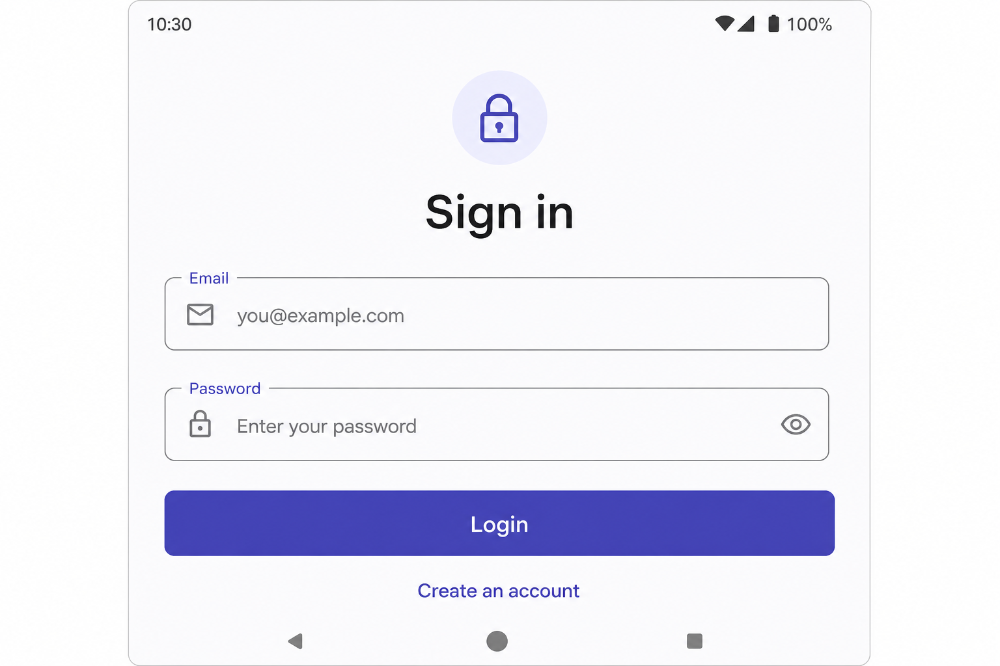
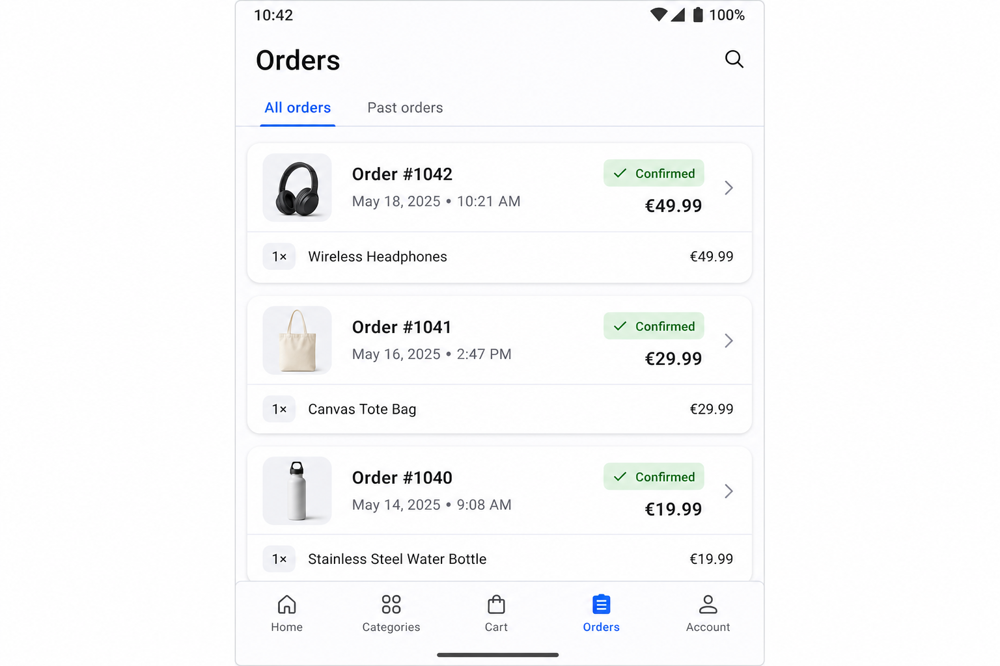
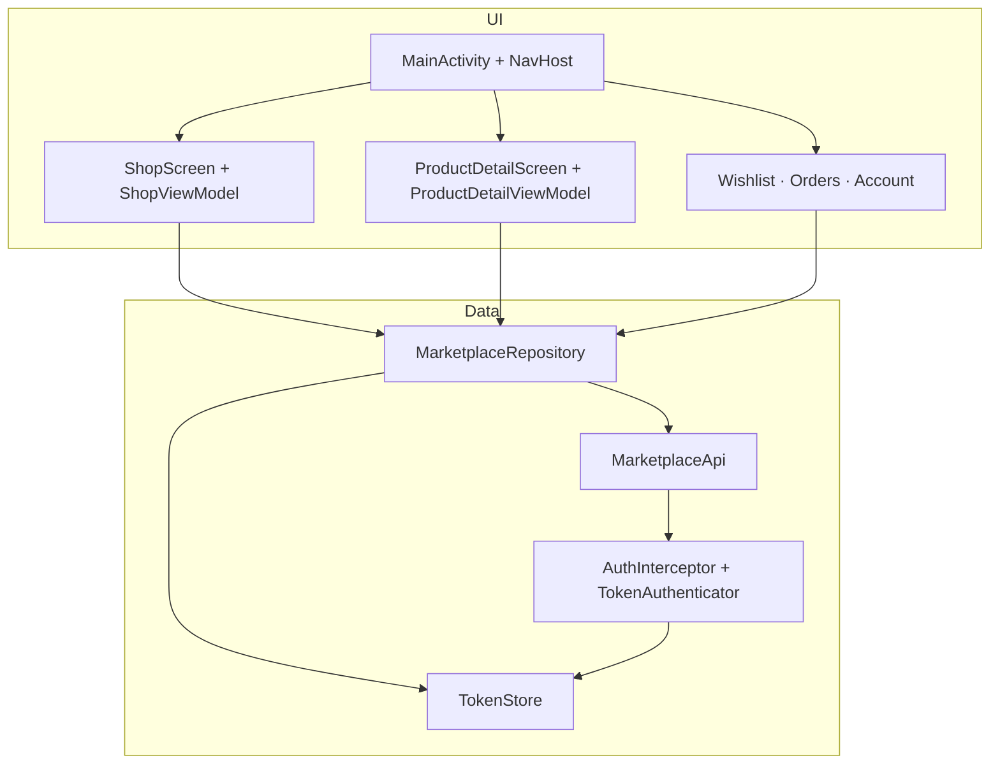

# Android Marketplace Client

[](https://github.com/sameh-bakleh/android-marketplace-client/actions/workflows/android-ci.yml)

**Kotlin · Jetpack Compose · Retrofit · JWT**

Supporting portfolio sample — native Android client for a multi-vendor marketplace REST API. Demonstrates the same product domain as my **primary iOS marketplace app** without competing for attention: catalog, auth, wishlist, orders, and checkout against a Symfony backend.

| | |
|---|---|
| **Repo** | `android-marketplace-client` |
| **Package** | `com.marketplace.app` |
| **Platform** | Android 8+ (API 26) · Kotlin 2.0 |
| **Positioning** | **iOS-first** mobile engineer — this repo proves **cross-platform** depth on a shared API contract |
| **Evaluate in** | ~10 min (clone → tests → skim `data/` + `ui/`) |

Pair with [ios-marketplace-product-app](https://github.com/sameh-bakleh/ios-marketplace-product-app) (primary mobile sample) and [symfony-marketplace-api](https://github.com/sameh-bakleh/symfony-marketplace-api) (Symfony backend).

---

## What it proves

| Skill | Implementation |
|-------|----------------|
| **Compose UI** | Material 3, bottom tabs, Navigation Compose, Coil image loading |
| **REST integration** | Retrofit 2, Gson DTOs, paginated catalog, search/filter/sort |
| **JWT auth** | Login/register, DataStore token persistence, OkHttp `Authenticator` refresh on 401 |
| **Product flows** | Browse → detail → place order; wishlist add/remove; order history |
| **State handling** | Loading indicators, inline errors with retry, auth gates on protected tabs |
| **Quality** | Unit tests (repository, ViewModel, utils), Android Lint, GitHub Actions CI |

Public browsing works without login; wishlist, checkout, and profile require a valid token.

---

## Screenshots

| Shop | Product detail |
|------|----------------|
|  |  |

| Login | Orders |
|-------|--------|
|  |  |

---

## Tech stack

| Layer | Choice |
|-------|--------|
| UI | Jetpack Compose, Material 3, Navigation Compose, Coil |
| Architecture | Repository pattern, MVVM (`ShopViewModel`, `ProductDetailViewModel`), manual DI (`AppContainer`) |
| Networking | Retrofit 2, OkHttp, Gson |
| Storage | DataStore Preferences (access + refresh tokens) |
| Build | Gradle 8.9, AGP 8.7, `compileSdk` 35 |
| Tests | JUnit 4, MockK, kotlinx-coroutines-test |
| CI | GitHub Actions — unit tests, lint, debug APK |

---

## Architecture

Compose UI → repository → Retrofit API + DataStore.



Deeper notes: [Docs/ARCHITECTURE.md](Docs/ARCHITECTURE.md)

---

## How to run

**Prerequisites:** JDK 17 · Android Studio (or CLI + Android SDK) · API 26+ emulator or device · [symfony-marketplace-api](https://github.com/sameh-bakleh/symfony-marketplace-api) running locally

### 1. Clone and configure

```bash
git clone https://github.com/sameh-bakleh/android-marketplace-client.git
cd android-marketplace-client

# SDK path (required for CLI builds; Android Studio creates this automatically)
cp local.properties.example local.properties
# Edit sdk.dir in local.properties
```

Optional API URL override — add to `local.properties` (see [`.env.example`](.env.example) for reference):

```properties
API_BASE_URL=http://10.0.2.2:8080
```

| Target | `API_BASE_URL` |
|--------|----------------|
| Emulator (default) | `http://10.0.2.2:8080` |
| Physical device | `http://<LAN-IP>:8080` |

### 2. Start the backend

```bash
git clone https://github.com/sameh-bakleh/symfony-marketplace-api.git
cd symfony-marketplace-api && cp .env.example .env
docker compose up -d --build
# Host API: http://localhost:8080
```

### 3. Build and run

```bash
./gradlew assembleDebug
# APK: app/build/outputs/apk/debug/app-debug.apk
```

Android Studio: **File → Open** → this folder → Run on emulator.

Cleartext HTTP is limited to dev hosts — see `app/src/main/res/xml/network_security_config.xml`.

---

## How to test

```bash
./gradlew testDebugUnitTest    # unit tests
./gradlew lintDebug            # Android Lint
./gradlew assembleDebug        # compile check
```

| Test file | Covers |
|-----------|--------|
| `MoneyTest` | Price formatting |
| `MarketplaceRepositoryTest` | Login success/failure, token persistence |
| `ShopViewModelTest` | Catalog load, sort reload |
| `ProductDetailViewModelTest` | Checkout success, auth gate when logged out |

CI runs the same commands on every push and PR — see [`.github/workflows/android-ci.yml`](.github/workflows/android-ci.yml).

---

## API contract (summary)

| Auth | Endpoints |
|------|-----------|
| Public | `GET /api/categories`, `GET /api/products`, `GET /api/products/{id}` |
| Authenticated | `POST /api/auth/*`, `GET /api/me`, wishlist, orders |

Full API docs: backend repo (`/api/doc` with Nelmio).

---

## Security

- **No secrets in git** — `local.properties`, keystores, and `.env` are gitignored.
- **Config templates:** [`local.properties.example`](local.properties.example), [`.env.example`](.env.example)
- **Dev-only cleartext HTTP** for `10.0.2.2` / `localhost`.
- **Tokens** in DataStore Preferences (demo-appropriate; production would use encrypted storage).

Details: [SECURITY.md](SECURITY.md)

---

## Cross-platform context

This Android client intentionally mirrors the **same REST contract** as [ios-marketplace-product-app](https://github.com/sameh-bakleh/ios-marketplace-product-app):

| Concern | iOS (primary) | Android (this repo) |
|---------|---------------|---------------------|
| UI | SwiftUI | Jetpack Compose |
| Auth storage | Keychain | DataStore |
| HTTP | Alamofire | Retrofit + OkHttp |
| Pagination | Infinite scroll | Paged load-more |
| Favorites | Favorites tab | Wishlist tab |

My portfolio positioning is **iOS-first**; this repo shows I can deliver a credible second native client when a team needs cross-platform mobile coverage.

---

## Related projects

| Repository | Role |
|------------|------|
| [ios-marketplace-product-app](https://github.com/sameh-bakleh/ios-marketplace-product-app) | **Primary mobile sample** — SwiftUI, MVVM, Keychain |
| [symfony-marketplace-api](https://github.com/sameh-bakleh/symfony-marketplace-api) | Symfony 7 REST API, JWT, Docker, PHPUnit |

---

## Contributing

See [CONTRIBUTING.md](CONTRIBUTING.md). PRs should pass CI (`testDebugUnitTest`, `lintDebug`).

## License

[MIT](LICENSE)
